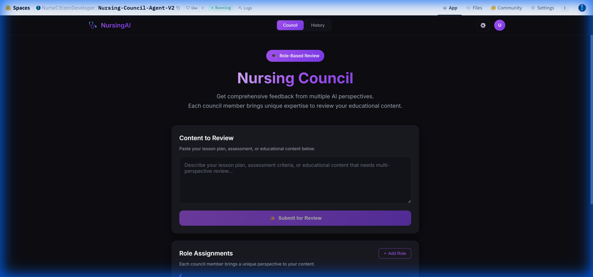
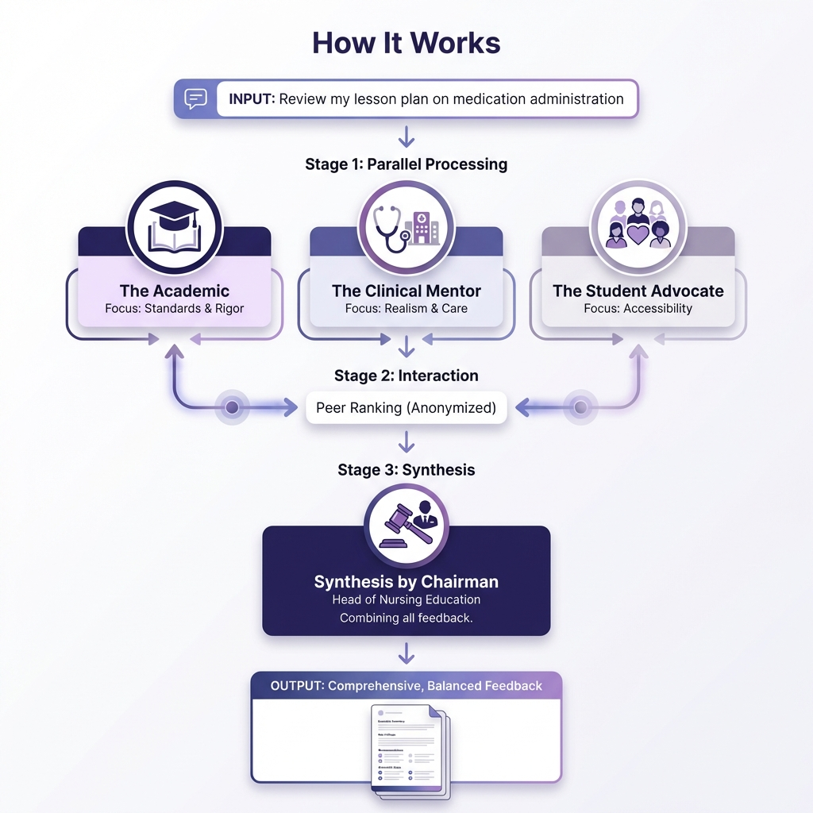

# Nursing Council Agent

> **Adapted from [karpathy/llm-council](https://github.com/karpathy/llm-council) for UK Nursing Education**

## Nurses as Citizen Developers 🩺💻

The **Nursing Council Agent** is a prime example of the "**Nurse as Citizen Developer**" movement. It demonstrates how nursing professionals can leverage low-code and generative AI technologies to build bespoke tools that solve specific educational and clinical challenges without needing deep traditional software engineering backgrounds.

Developed by **Lincoln (Ai Education)**, this tool empowers nurse educators to maintain high standards of quality and consistency in curriculum design by automating multi-perspective peer reviews.

## The Concept

Instead of asking one AI for feedback, the **Nursing Council** convenes three AI "experts" who each bring a different perspective:

| Role | Focus |
|------|-------|
| 🎓 **The Academic** | NMC Standards alignment, evidence-based practice, scholarly rigor |
| 🏥 **The Clinical Mentor** | Ward realism, clinical applicability, compassionate care |
| 👩‍🎓 **The Student Advocate** | Accessibility, clarity, diverse learning needs |

The **Head of Nursing Education** (Chairman) then synthesizes their feedback into actionable recommendations.

## Advanced Features

- 💾 **Persistent History**: Conversations are saved securely using Azure Blob Storage.
- 📄 **Export to PDF**: Generate professional feedback reports for sharing or documentation.
- 🎭 **Custom Roles**: Add your own expertise layers (e.g. "Public Health Lead" or "Dementia Specialist").
- 🔐 **Azure Authentication**: Built-in Entra ID (Active Directory) protection for organizational security.

## Quick Start (Azure Deployment)

This repository is optimized for deployment to **Azure Container Apps**.

1. **Deploy to Azure**: Use the provided Dockerfile to build and push to Azure Container Registry.
2. **Environment Variables**:
   - `AZURE_OPENAI_API_KEY`: Your model key.
   - `AZURE_OPENAI_ENDPOINT`: Your Azure endpoint.
   - `AZURE_STORAGE_CONNECTION_STRING`: For persistent history.
3. **Authentication**: Enable "Easy Auth" (Microsoft provider) in the Azure Portal or via CLI.

## Local Development (GitHub Codespaces)

1. **Fork this repository** to your GitHub account.
2. Click the green **"Code"** button → **"Open with Codespaces"**.
3. Create a `.env` file with your credentials.
4. Run `./start.sh` and make port **8001** public.

## How It Works

## License

MIT License - See [LICENSE](LICENSE) for details.

---

**Built by Lincoln @ [Ai Education](https://practicedev.cloud)**
*Empowering nursing through AI Literacy and Citizen Development.*
